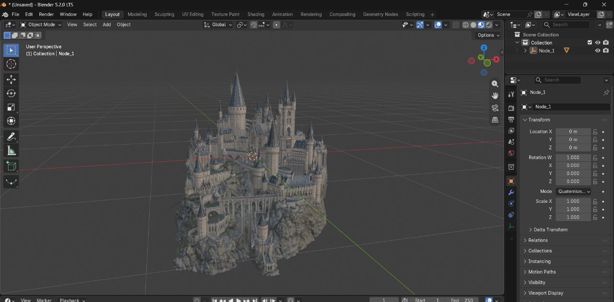

# Meshy.ai 3D Model Downloader

Downloads 3D models from Meshy.ai as `.glb` files using Playwright to intercept the decrypted GLB data directly from the browser's Web Worker.



## How it works

Meshy.ai encrypts model files (`.meshy` format) and decrypts them in-browser via WebAssembly in a Web Worker. This script hooks into the Worker to capture the decrypted GLB binary before it's rendered.

## Usage

```bash
python main.py "https://www.meshy.ai/3d-models/YOUR-MODEL-URL"
python main.py "https://www.meshy.ai/3d-models/..." ./output_folder
```

## Requirements

```bash
pip install playwright
playwright install chromium
```

## Notes

- Bypasses AWS WAF bot protection automatically via Playwright
- Saves valid glTF Binary (`.glb`) files compatible with Blender, Three.js, etc.
- Uses the same ACES Filmic rendering pipeline as Meshy's own viewer
